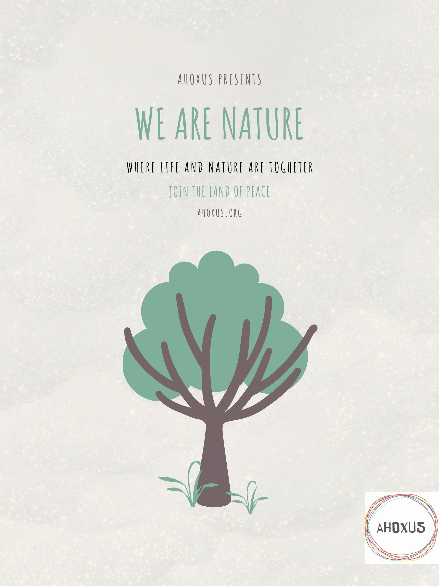



**ahoxus** is our life's project. a self sustainable intentional community. regenerative culture movement. in 10ha, north of portugal.

in practice: we're going to live in cheap shelters on a piece of land on the countryside, with trees and away from the cities or big buildings. and cultivate the land to have better water and nature than before we arrived. without completely forgetting some basic and cheap conveniences, like a hot shower (solar heated) and the internet.

# come co-create a paradise

here's an idea. to be discussed and thought through together.

until june 1st 2020, we are accepting 10 new members. the idea will only continue if we get the new members.

we want people who are ready to shift their world and live with us for 1 year. read everything here. talk to us. act by yourself.

it's a project being made from scratch, now entering phase 1 of execution. this includes cooperating on flourishing an integrated living following our core values in portugal's countryside.

at first, it'll not be self-sustainable, so we will build it all. the daily cost will start as low as 10 euros. all basic needs are covered, such as water, food, electricity, and internet.

with as little as 5k eur we can help you to purchase and install your mobile home in our land. you can then move it out to anywhere you want. it's your home!

when the project hits phase 2 and becomes completely self-sustainable, we'll add an option for visitors at 20 eur for at least 1 week. the income will go to the community and may be shared among members.

those daily costs can be further reduced, depending on how much value you can bring. everyone will be required to live and work in the community. kitchen. garden. composting. maintenance in general. an equivalent shift of up to 4h per day, average. 20h per week. but we don't really think in those terms, as you'll learn...

doing the math, you can easily retire within our lifestyle. in an analogy mixed with estimate, with just 60k in your pocket you can pay for at least 10 years of costs.

no smokers. zero tolerance in this phase. it's essential for security against wood fire, in portugal.

only organic material is allowed to go in the land, from cosmetics to paint and anything that may quickly leak underground.

recapitulating the main points:

- be #readytoshift and act fast.

- bring your home.

- get at least 3650 eur ready for minimal costs over 1 year.

- pay attention to all details

- come enjoy life at with all its potential and in harmony!

# wip tk

this is a *work in progress*, *"to kome"*. being written by [cregox](https://cregox.net/ahoxus).

keep on reading:

- [a little story](/story)

- [core principles](/core)

or:

- get in [touch](https://cregox.net/contact).

- sign up for our [updates here](/updates) (such as with your email for our mailing list).

