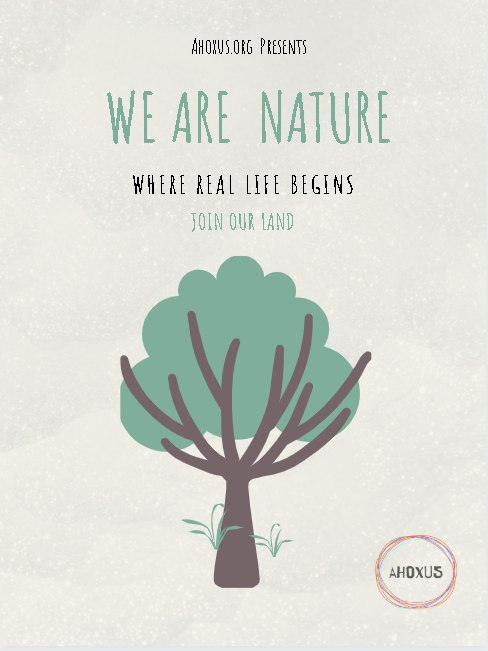



**ahoxus** is a project for life.

choose your chapter (or just keep scrolling down):

- [start living in a new world](#come-live-with-us)

- [skip the story below](#not-really)

- [skip to practice](#still-what)

- [some core philosophical values](#ok-sounds-crazy)

# the big kid

> a long time ago a big kid, aH, was playing around and chasing a beautiful butterfly on the sunrise.

> suddenly, aH saw another kid, oX, doing some chores, annoyed, and felt the back as if hit by a lightning bolt. aH felt on the ground, in a deadly pain with an almost silent and deep roar.

> oX, who was annoyed by something, came around, saw aH on the floor, remembered how sometimes aH just lay down there, and complained something to aH then moved away, annoyed for getting no answer. after a while oX came back and finally noticed aH was seriously injured.

> now worried about the weird deadly pain, they went to seek help. took a long path over the mountains, to find other big kids: the medics. one looked at the injury and heard their story. then, the medic was sorry, for there was nothing the medics could do. then the medic continued to take care of other kids, who were bleeding or unconscious.

> aH was, after all, basically recovered by the time it took to get to the medic. but the pain was real. and so was the invisible internal scar...

ahoxus was born after the real story on which this little tale is based; on aH, oX and their friends' quest to heal and discover ways for others to follow the same steps.

after all, isn't that the same story for everyone?

# [not really...](#top)

think about it. we all need so much more reconnection with ourselves! both in general (just look at how fast the world can heal when we stop and take it slow) and within each one of us (also to prevent such inexplicable body malfunctions).

ahoxus is made of people who live and work on this land in portugal, together in small groups, towards improving and regenerating the whole world through little actions.

and we invite **you** to join us!

# [what?](#top)

yes, you, who might be willing to understand our quest, and discover it together.

> ps: we're making weekly [updates](/updates) in a very transparent manner (by "very", i mean "messy") using **pioneer**. if you are reading this and coming from [pioneer](/pioneer), by all means, please [read that](/pioneer) first!

# [still... what?!](#top)

in practice: we're going to live in cheap shelters on a piece of land with trees, away from the cities or big buildings. and cultivate the land to have better water and nature than before we arrived. without completely forgetting some basic and cheap conveniences, like a hot shower (solar heated) and the internet.

# [ok... sounds crazy!](#top)

well, yeah.

it's big!

after all, "the whole world" means both each small group's reality and of everyone's.

we are constantly focusing on the small things. moving slowly. steady.

keep on reading:

- [core principles](/core)

or...

# [come co-create a paradise](#top)

here's an idea. to be discussed and thought through together.

until june 1st 2020, we are accepting 10 new members. the idea will only continue of we get the new members.

we want people who are ready to shift their world and live with us for 1 year. read everything here. talk to us. act by yourself.

it's a project being made from scratch, now entering phase 1 of execution. this includes cooperating on flourishing an integrated living following our core values in portugal's country side.

at first, it'll not be self sustainable, so we will build it all. the daily cost will start as low as 10 euros. all basic needs are covered, such as water, food, electricity and internet.

with as little as 5k eur we can help you to purchase and install your mobile home in our land. you can then move it out to anywhere you want. it's your home!

when the project hits phase 2 and becomes completely self sustainable, we'll add an option for visitors at 20 eur for at least 1 week. the income will go to the community, and may be shared among members.

those daily costs can be further reduced, depending on how much value you can bring. everyone will be required to live and work in the community. kitchen. garden. composting. maintenance in general. an equivalent shift of up to 4h per day, average. 20h per week. but we don't really think in those terms, as you'll learn...

doing the math, you can easily retire within our lifestyle. in an analogy mixed with estimate, with just 60k in your pocket you can pay for at least 10 years of costs.

no smokers. zero tolerance in this phase. it's essential for security against wood fire, in portugal.

only organic material is allowed to go in the land, from cosmetics to paint and anything that may quickly leak underground.

recapitulating the main points:

- be #readytoshift and act fast.

- bring your home.

- get at least 3650 eur ready for minimal costs over 1 year.

- pay attention to all details

- come enjoy life at with all its potential and in harmony!

# [wip tk](#top)

this is a *work in progress*, *"to kome"*. being written by [cregox](https://cregox.net/ahoxus).

- get in [touch](https://cregox.net/contact).

- sign up for our [updates here](/updates) (such as with your email for our mailing list).

