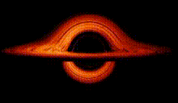

before [tamera](/tamera) and focusing the project in community... there was little clue what ahoxus was!

{{ page.description }}

# white hole

these are 2 simulations from the first black hole we've ever seen.

  

  
  this one in YouTube is much cooler, though... and probably even more precise!

  <iframe width="400" height="225" src="https://www.youtube.com/embed/KikdPbX7z8Q" frameborder="0" allow="accelerometer; autoplay; encrypted-media; gyroscope; picture-in-picture" allowfullscreen></iframe>

now we shall do our own ahoxus version, you know, for promotion! ;)

the idea is simply using our colors there, with some mutation and the white background instead of black.

thus, becoming our beloved white hole.


